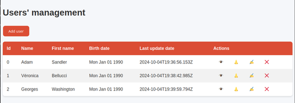
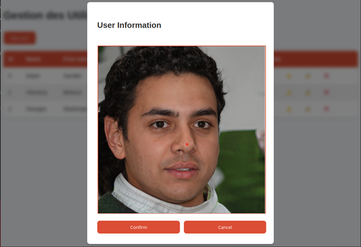

# 👃 Nose localisation web app

This app was made to learn more about building a full-stack web app. The goal is to have an app helping people to generate data to train a machine learning model to do it automatically.

This is built using typescript, mongodb and expressjs.

I'm working on implementing `docker-compose` to easily deploy it on any machine.

## 💻 Install and run

A mongodb must run on `localhost:27017`.

First, you need to install all the dependencies of the project using:
```sh
npm i
```

And then, you can run
```sh
npm run start
```
to build and launch the application. With the current version of the project, the app will watch for any change to update its state.


## 🖱️ Tests end-to-end

I've chose to implement Playwright which allow to test the app from the user POV to make sure any breaking changes can be quickly identified as the updates goes.
```sh
npm run e2e
```
It is still in **WIP** for the moment, to finalize implement more complicated tests.

## 🧪 Unit tests

Not implemented for the moment.

## UI screenshots






nomook_
